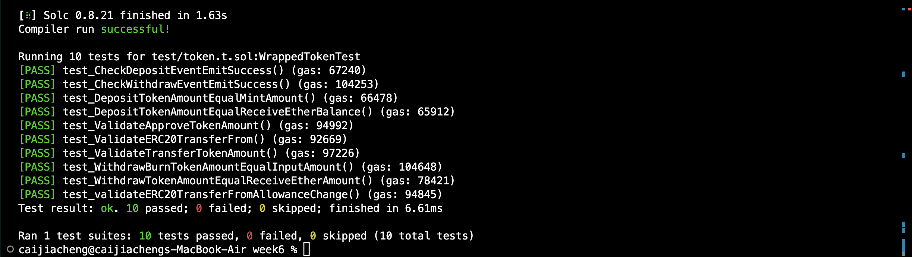

Table of Content
- [Introduction](#introduction)
- [Environment Setup](#environment-setup)
- [Start Testing](#start-testing)
- [Wrapped Token](#wrapped-token)
  - [System Design](#system-design)
  - [Implementation](#implementation)
- [Testing Procedure](#testing-procedure)

## Introduction

This project demonstrate the practice from **AppWorks School Blockchain Program Batch 3**.

In the previous classes, we explored the basic concepts of wrapped tokens and developed our own implementation. In this assignment, we will delve deeply into the testing framework called 'Foundry' to enhance the security of our contract, with the wrapped token contract serving as the practice ground.

## Environment Setup

Environment Dependencies
+ git
+ foundry

Download Foundry

```bash
curl -L https://foundry.paradigm.xyz | bash
```

```bash
Foundryup
```

Check the version of `forge`, `cast` and `anvil` with `forge --version`, `cast --version` and `anvil --version` commands respectively.

## Start Testing

There are 10 tests in total, please follow the steps to see the testing results.

+ Clone the project on your local environment

```bash
git clone git@github.com:LouisTsai-Csie/Blocktrain.git
```

+ enter the `week6` foundry project

```bash
cd week6
```

+ test the contract

```bash
forge test
```

The result should be the same as the following screen shot.



## Wrapped Token

The wrapped token contract serves the crucial role of maintaining the pegged value between the Ethereum native cryptocurrency, Ether, and standard ERC-20 tokens. 

Given that Ether, as the native token of Ethereum, does not adhere to the ERC-20 token standard, it cannot be directly traded among other tokens within the system. The wrapped token mechanism resolves this issue by supporting two fundamental operations:

(1) Depositing a specific amount of Ether and receiving an equivalent amount of ERC-20 tokens in return.

(2) Withdrawing ERC-20 tokens and exchanging them for Ether by burning the corresponding Ether tokens to uphold the pegged value.


### System Design

This project follows the oppenzeppelin ERC-20 implementation for security concerns.

The contract supports two operation: 

**deposit**

The contract mints and transfers an equivalent amount of ERC-20 tokens to the user, corresponding to the Ether they have locked.

**withdraw**

The contract burns and transfers an equivalent amount of Ether to users in exchange for the ERC-20 tokens they wish to withdraw.


### Implementation

The wrapped token contract is shown in both `src/token.sol` and [gist](https://gist.github.com/dd756e870b177504f88648456f15836b.git).

<script src=""></script>

## Testing Procedure

There are 10 tests in total.

The quick overview of the tests:

| Test Name                                       | Overview                                                                                      |
|-------------------------------------------------|-----------------------------------------------------------------------------------------------|
| test_DepositTokenAmountEqualMintAmount          | User should receive equivalent amount of ERC-20 token they deposit Ethers into the contract.  |
| test_DepositTokenAmountEqualReceiveEtherBalance | The contract should receive equivalent amount of Ethers the user deposits.                    |
| test_CheckDepositEventEmitSuccess               | Once the deposit process completes, there should be an event.                                 |
| test_WithdrawBurnTokenAmountEqualInputAmount    | The token burnt should be the same to the input parameter of withdraw function.               |
| test_WithdrawTokenAmountEqualReceiveEtherAmount | User should receive equivalent amount of Ethers as the ERC-20 they sent as exchange.          |
| test_CheckWithdrawEventEmitSuccess              | Once the withdraw process completes, there should be an event.                                |
| test_ValidateTransferTokenAmount                | The transfer token process should have correct amount and destination.                        |
| test_ValidateApproveTokenAmount                 | Check the user allowance after the approve operation.                                         |
| test_ValidateERC20TransferFrom                  | Check the success of transferFrom operation.                                                  |
| test_validateERC20TransferFromAllowanceChange   | Validate the allowance changes before/after the approve and transferFrom operations.          |

The implementation details of the tests can be found in the comment of test files in `test/token.t.sol`


